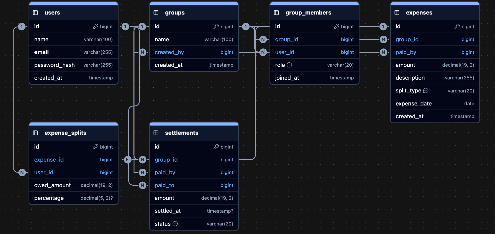

# 💰 Shared Expense Splitting App

A production-style **Shared Expense Splitting Backend Application** built using Java, Spring Boot, Spring Data JPA, MySQL, and REST APIs.

The application allows a group of people to track shared expenses, split expenses using different methods, maintain each member's running balance, and calculate the smallest possible set of payments required to settle all outstanding balances.

The project is designed to demonstrate enterprise backend development practices such as layered architecture, DTO mapping, JPA relationships, validation, exception handling, transaction management, testing, and clean code principles.

> **Status:** 🚧 In active development. This README describes the full project vision — see the [Development Roadmap](#-development-roadmap) for what's actually implemented so far.

---

## 📑 Table of Contents

- [Features](#-features)
- [Tech Stack](#-tech-stack)
- [Project Structure](#-project-structure)
- [Core Business Workflow](#-core-business-workflow)
- [Database Design](#-database-design)
- [Balance Calculation](#️-balance-calculation)
- [Settlement Algorithm](#-settlement-algorithm)
- [Development Roadmap](#-development-roadmap)
- [Git Branch Strategy](#-git-branch-strategy)
- [API Documentation](#-api-documentation)
- [Security](#-security)
- [Testing](#-testing)
- [Example](#-example)
- [Future Enhancements](#-future-enhancements)
- [Author](#-author)

---

## 🚀 Features

### 👥 Group Management
- Create expense groups
- Add members to groups
- Remove members from groups
- View group members

### 💸 Expense Management
- Add shared expenses
- Record who paid the expense
- Track expense description and amount
- Associate expenses with a group
- View expense history

### ⚖️ Expense Splitting

Supports multiple splitting methods:

- **Equal Split**
- **Percentage Split**
- **Exact Amount Split**

Example — a ₹1,000 expense shared by 4 members:

**Equal Split**
```
₹250 each
```

**Percentage Split**
```
Member A → 50% → ₹500
Member B → 30% → ₹300
Member C → 20% → ₹200
Member D → 0%   → ₹0
```

**Exact Amount Split**
```
Member A → ₹500
Member B → ₹300
Member C → ₹200
```

### 📊 Balance Tracking

At any point, the system should be able to answer:

> "After everything we've spent so far, who owes money and who should receive money?"

The system maintains each member's running balance within a group.

Example:
```
Alice   → +₹500
Bob     → -₹300
Charlie → -₹200
```

Meaning:
- Alice should receive ₹500
- Bob owes ₹300
- Charlie owes ₹200

### 💰 Expense Settlement

Calculates the minimum number of transactions required to settle all outstanding balances.

Example:
```
Bob     → Alice ₹300
Charlie → Alice ₹200
```

Instead of requiring every member to pay every other member individually.

### 🔍 Search & Filtering
- Search expenses
- Filter expenses by group
- Filter by member
- Filter by date
- Pagination for large expense histories

### 🛡 Validation & Exception Handling
- Validate expense amounts
- Validate split percentages
- Validate exact split amounts
- Prevent invalid group members
- Prevent duplicate group memberships
- Global exception handling
- Meaningful API error responses

### 📝 Audit & Logging
- Request logging
- Expense creation logging
- Settlement calculation logging
- Important business operation auditing

---

## 🛠 Tech Stack

| Category | Technology |
|---|---|
| Language | Java 21 |
| Framework | Spring Boot, Spring MVC |
| Persistence | Spring Data JPA (Hibernate), MySQL |
| Build Tool | Maven |
| Utilities | Lombok |
| Validation | Spring Validation |
| Cross-cutting | Spring AOP |
| Security | Spring Security |
| API Docs | Swagger / OpenAPI |
| Testing | JUnit 5, Mockito, MockMvc |
| Tooling | Git & GitHub, Postman |

---

## 📁 Project Structure

```
src/main/java/com/shaurya/sharedexpensesplittingapplication
├── controller
├── service
│   └── impl
├── repository
├── model
│   ├── entity
│   └── enums
├── dto
│   ├── request
│   └── response
├── mapper
├── exception
├── aspect
├── config
└── SharedExpenseSplittingApplication
```

The architecture follows a layered approach:

```
Client
   ↓
Controller
   ↓
Service
   ↓
Repository
   ↓
MySQL
```

---

## 📖 Core Business Workflow

### 1. Create Group
A user creates an expense group.
```
Create Group
     ↓
Add Members
     ↓
Group Ready
```

### 2. Add Expense
A member records an expense.
```
Expense: Dinner
Amount:  ₹1,200
Paid By: Alice
Group:   Friends
Split:   Equal
```

### 3. Calculate Individual Shares
For 4 members: `₹1,200 / 4 = ₹300 each`

| Member | Paid | Share |
|---|---|---|
| Alice | ₹1,200 | ₹300 |
| Bob | ₹0 | ₹300 |
| Charlie | ₹0 | ₹300 |
| David | ₹0 | ₹300 |

### 4. Update Running Balances
```
Balance = Amount Paid - Amount Owed
```

Result:
```
Alice   → +₹900
Bob     → -₹300
Charlie → -₹300
David   → -₹300
```

Therefore: Alice should receive ₹900; Bob, Charlie, and David each owe ₹300.

### 5. Generate Settlement
The system calculates the smallest possible set of transactions:
```
Bob     → Alice ₹300
Charlie → Alice ₹300
David   → Alice ₹300
```

After settlement, every member's balance is ₹0.

---

## 🗄 Database Design

### Planned Entities
- `User`
- `Group`
- `GroupMember`
- `Expense`
- `ExpenseSplit`
- `Settlement`

### ER Diagram



### Relationships

```
User
 ├── GroupMember ── Group
 ├── Expense ── ExpenseSplit
 └── Settlement
```

```
Group
 └── Expense
       ├── Paid By → User
       └── ExpenseSplit → User
```

> Entity relationships may evolve slightly during implementation as the domain model is refined.

---

## ⚖️ Balance Calculation

For each member:

```
Net Balance = Total Paid - Total Share
```

- **Positive balance** → member should receive money
- **Negative balance** → member owes money
- **Zero balance** → member is settled

Example:
```
Total Paid  = ₹2,000
Total Share = ₹1,200
Net Balance = ₹800   → member should receive ₹800
```

---

## 🔄 Settlement Algorithm

The settlement engine minimizes the number of transactions required to settle a group, rather than generating a payment for every individual expense.

Example:
```
A → +₹700
B → +₹300
C → -₹500
D → -₹500
```

Possible settlement:
```
C → A ₹500
D → A ₹200
D → B ₹300
```

---

## 📌 Development Roadmap

### Phase 1 — Project Setup
- [x] Create Spring Boot project
- [x] Configure Maven
- [x] Configure MySQL
- [x] Configure Git repository
- [x] Configure application properties
- [x] Create initial project structure

### Phase 2 — Domain Design
- [x] Design entities
- [x] Define enums
- [x] Define relationships
- [ ] Configure JPA mappings

### Phase 3 — Repository Layer
- [ ] Create repositories
- [ ] Add custom queries
- [ ] Add balance-related queries

### Phase 4 — DTO & Mapper Layer
- [ ] Create request DTOs
- [ ] Create response DTOs
- [ ] Create entity-to-DTO mappings

### Phase 5 — Service Layer
- [ ] Group management
- [ ] Member management
- [ ] Expense management
- [ ] Equal split
- [ ] Percentage split
- [ ] Exact amount split
- [ ] Balance calculation
- [ ] Settlement calculation

### Phase 6 — REST APIs
- [ ] Group APIs
- [ ] Member APIs
- [ ] Expense APIs
- [ ] Balance APIs
- [ ] Settlement APIs

### Phase 7 — Validation & Exception Handling
- [ ] Request validation
- [ ] Business validation
- [ ] Custom exceptions
- [ ] Global exception handler
- [ ] Standard error response

### Phase 8 — Pagination & Search
- [ ] Expense pagination
- [ ] Expense search
- [ ] Date filtering
- [ ] Member filtering

### Phase 9 — AOP
- [ ] Request logging
- [ ] Service execution logging
- [ ] Expense audit logging
- [ ] Settlement audit logging

### Phase 10 — Documentation
- [ ] Swagger / OpenAPI
- [ ] API documentation
- [ ] Postman collection
- [ ] Architecture documentation

### Phase 11 — Security
- [ ] Spring Security
- [ ] User authentication
- [ ] Password hashing
- [ ] Role-based authorization
- [ ] Protected APIs

### Phase 12 — Testing
- [ ] Service unit tests
- [ ] Controller tests
- [ ] Repository tests
- [ ] Integration tests
- [ ] Settlement algorithm tests

---

## 🌿 Git Branch Strategy

```
main
├── feature/project-setup
├── feature/entities
├── feature/repositories
├── feature/dto-mapper
├── feature/service-layer
├── feature/expense-splitting
├── feature/balance-calculation
├── feature/settlement
├── feature/rest-api
├── feature/validation-exception
├── feature/pagination-search
├── feature/aop
├── feature/documentation
├── feature/spring-security
└── feature/testing
```

Each major feature is developed in its own branch and merged into `main` through a Pull Request.

---

## 📮 API Documentation

API documentation is provided using Swagger / OpenAPI.

- **Swagger UI:** `http://localhost:8080/swagger-ui/index.html`
- **OpenAPI JSON:** `http://localhost:8080/v3/api-docs`

Postman is also used for manual API testing.

---

## 🔐 Security

Planned security implementation:

- Spring Security
- Authentication
- Role-based authorization
- Password hashing using BCrypt
- Protected REST endpoints

JWT authentication may be added as a future enhancement.

---

## 🧪 Testing

Testing is implemented using JUnit 5, Mockito, MockMvc, Spring Boot Test, and Postman.

Coverage flows through the layers:

```
Service Layer
     ↓
Controller Layer
     ↓
Repository Layer
     ↓
Integration Testing
```

Special attention is given to:
- Equal split calculations
- Percentage validation
- Exact amount validation
- Balance calculations
- Settlement calculations
- Edge cases
- Invalid requests

---

## 💡 Example

Suppose a group contains Alice, Bob, and Charlie.

Alice pays **₹900** for dinner, split equally.

Each person's share: `₹900 / 3 = ₹300`

Balances:
```
Alice   → +₹600
Bob     → -₹300
Charlie → -₹300
```

Settlement:
```
Bob     → Alice ₹300
Charlie → Alice ₹300
```

After settlement, every member's balance is ₹0.

---

## 🚀 Future Enhancements

- JWT Authentication
- Docker Compose
- Redis caching
- Email notifications
- Expense reminders
- Recurring expenses
- Multi-currency support & currency conversion
- Advanced settlement optimization
- Spring AI integration
- Frontend application
- Export expenses to CSV/PDF
- Cloud deployment

---

## 👨‍💻 Author

**Shaurya Pratap Singh**
Java Backend Developer
